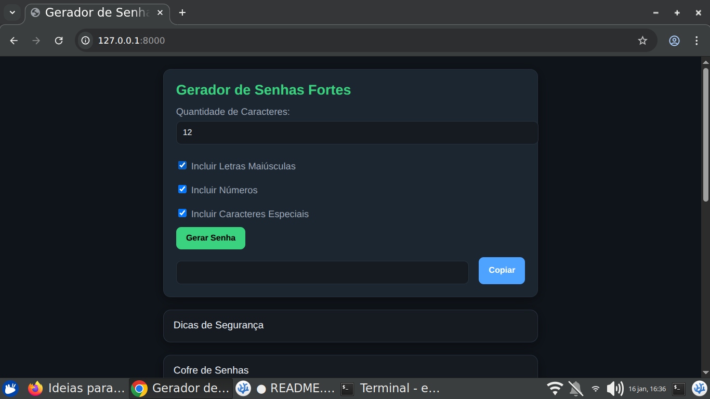
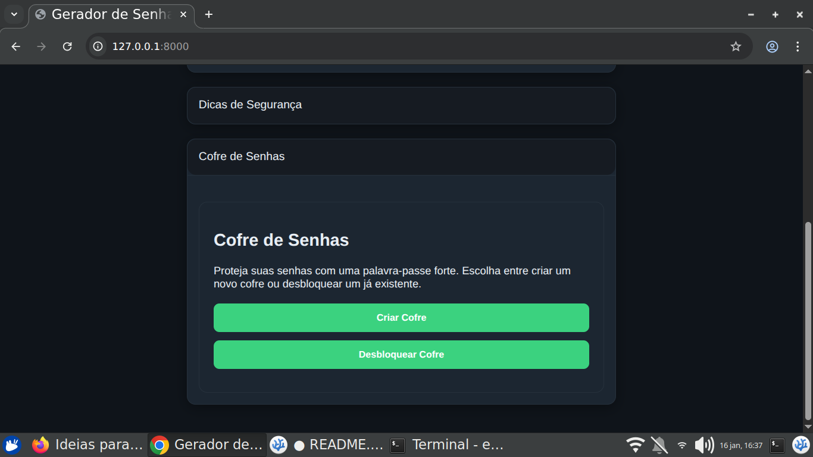
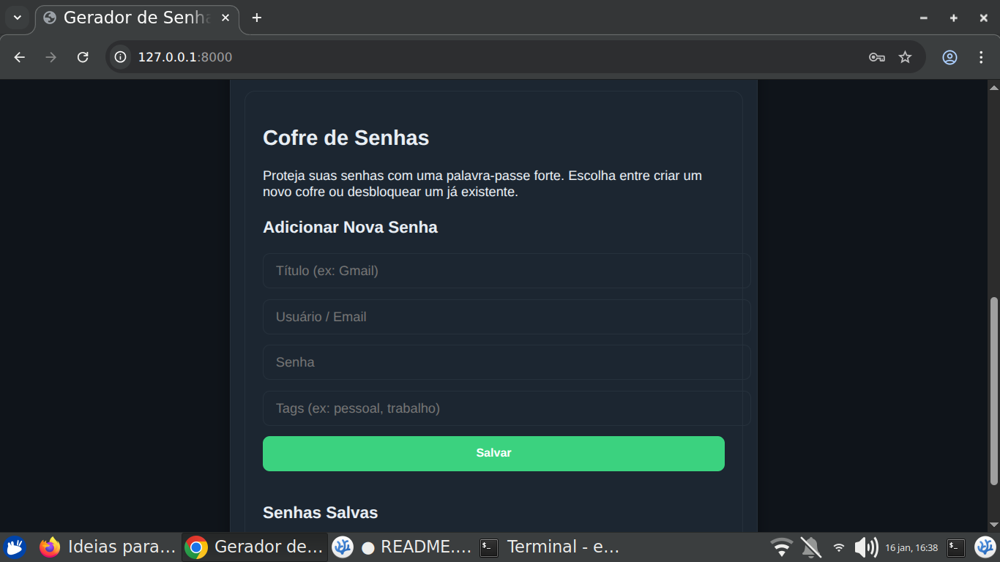

# 🔐 Password Generator + Secure Local Vault

Aplicação web que combina:

- **Gerador de senhas fortes**
- **Cofre criptografado localmente**
- **Armazenamento seguro (AES-GCM + PBKDF2)**
- **Suporte a CRUD de senhas (add / edit / delete)**
- **100% client-side, sem backend**
- **Uso do WebCrypto API**
- **UI moderna + modularização do código**

Este projeto foi desenvolvido com foco em **segurança**, **privacidade**, **organização**, e **arquitetura profissional** baseada em módulos.

---

## 📌 Índice

1. [Características](#-características)
2. [Tecnologias](#-tecnologias)
3. [Segurança do Cofre](#-segurança-do-cofre)
4. [Estrutura de Pastas](#-estrutura-de-pastas)
5. [Como Rodar o Projeto](#-como-rodar-o-projeto)
6. [Gerador de Senhas](#-gerador-de-senhas)
7. [Cofre de Senhas](#-cofre-de-senhas)
8. [Screenshots](#-screenshots)
9. [To-Do / Melhorias Futuras](#-to-do--melhorias-futuras)
10. [Licença](#-licença)

---

## 🔥 Características

✔ Gerador de senhas fortes (personalizável)  
✔ Botão de copiar senha  
✔ Cofre criptografado local  
✔ CRUD completo:  
   - adicionar  
   - editar  
   - remover  
✔ Modal de edição moderno  
✔ Separação em módulos JS  
✔ Armazenamento local seguro (`localStorage` + criptografia)  
✔ Sem servidores → sem vazamento de dados  
✔ Funciona offline  
✔ Preparado para virar um PWA  

---

## 🛠 Tecnologias

- **HTML5 semântico**
- **CSS3 modular**
- **JavaScript ES Modules**
- **WebCrypto API**
  - `AES-GCM` (criptografia)
  - `PBKDF2` (derivação de chave)
- **LocalStorage**
- **Arquitetura modular**

---

## 🔐 Segurança do Cofre

Todo o conteúdo salvo no cofre é protegido por:

### ✔ Derivação da chave com PBKDF2
- Iterações: `150.000`
- Hash: `SHA-256`
- Salt aleatório de 16 bytes

### ✔ Criptografia com AES-GCM
- 256 bits
- IV aleatório por operação

### ✔ Nada é salvo em texto puro
- Apenas ciphertext + iv + salt vão para o localStorage.

### ❌ O projeto nunca salva:
- senha-mestra
- senhas em texto
- chave de criptografia

Tudo é mantido **local e seguro**.

---

## 📁 Estrutura de Pastas
```bash

src/
├─ modules/
│ ├─ generator.js
│ ├─ clipboard.js
│ └─ vault/
│ ├─ vault-ui.js
│ ├─ vault-crypto.js
│ └─ vault-storage.js
└─ views/
└─ vault.html

assets/
└─ css (styles)

```
---

## ▶ Como Rodar o Projeto

Por segurança, o WebCrypto precisa ser rodado em **contexto seguro**.  
Use:

```bash
python3 -m http.server 8000 --bind 127.0.0.1

Acesse:

http://127.0.0.1:8000

🔑 Gerador de Senhas

Funcionalidades:

    Definir tamanho

    Escolher tipos de caracteres

    Geração aleatória com crypto.getRandomValues

    Botão de copiar para a área de transferência

🔏 Cofre de Senhas

Funcionalidades:

    Criar senha-mestra (primeiro acesso)

    Desbloqueio com verificação forte

    Adicionar entradas:

        título

        usuário/email

        senha

        tags

    Editar via modal

    Excluir

    Tudo criptografado em AES-GCM

🖼 Screenshots

Gerador de Senhas



Cofre Bloqueado



Cofre Desbloqueado




📌 To-Do / Melhorias Futuras

    Buscar senhas por tags

    Organização em categorias

    Modo escuro/tema customizável

    Exportar/importar cofre com senha

    Suporte completo a PWA (instalável)

    Gerador integrado com botão "salvar no cofre"

📄 Licença

Este projeto é de uso livre para fins educacionais e pessoais.
Modifique à vontade e mantenha a segurança como prioridade.
